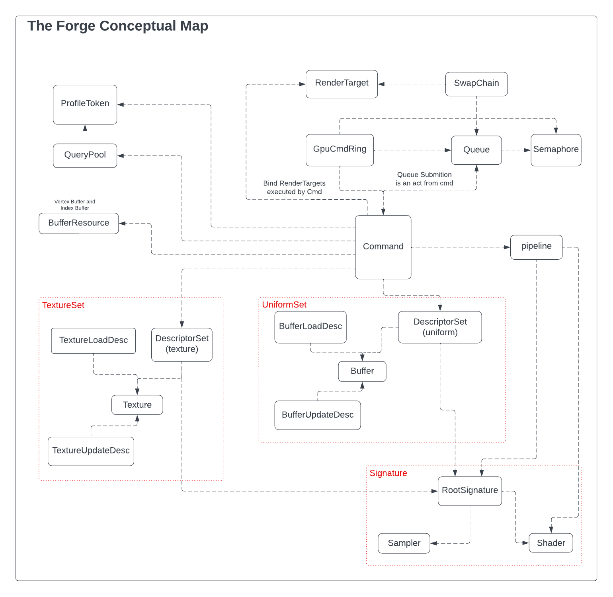

# Kokku Assignment
## [_Leandro Almeida de Araujo_]
[_Leandro Almeida de Araujo_]: (mailto:oxydation@gmail.com)

## Assignment repository

The repository for the assignment, including assets and binaries (.lib and .dll dependencies), can be found at [my own fork for TheForge repository](https://github.com/oxydated/The-Forge/tree/Refactoring). I trimmed down the Visual Studio solution in the path `The-Forge\Examples_3\Unit_Tests\PC Visual Studio 2019\Unit_Tests.sln` to include only my assignment project name **Castle**, so it's going to be easy to find it and open it. The Castle project code itself can be found at `The-Forge\Examples_3\Unit_Tests\src\Castle`.

## The Forge and a new class hierarchy

The example projects available in the repository for The Forge are written in a C-like code style as a single class representing all the application, with all methods in the same .cpp file with rather little organization and a lot of boilerplate code. Lack of documentation other than the code itself makes it only harder to understand and learn how to take the most of the template. On the bright side, if you know how modern graphics API as Vulkan or Direct3D12, it may be a little easier to understand how The Forge itself is organized and how it can be used, as its functions and structures match closely these graphics API.

That said, for this assignment I decided to write a class hierachy on top of The Forge to encapsulate most of its objects and functions and get ride of all the boilerplate of the example projects. I hope this class hierarchy will make it easier to write new applications and to reuse code.

The class hierarchy devised for this project is based on the following conceptual map I made to help understand how The Forge is organized:

## Rendering the Castle

To render the Castle I wrote a simple per-pixel lighting shader based on the Phong light model.

## FBX SDK

The best solution to deal with .fbx files I found given the time constraints in this project was to use the ``fbxsdk`` from Autodesk, which can be downloaded from [its site](https://help.autodesk.com/view/FBX/2020/ENU/?guid=FBX_Developer_Help_getting_started_html).

For convenience, I place the include and lib folders from the fbxsdk in the repository along with the dll binaries so you don't need to bother downloading, installing and setting the paths in the project configuration yourself. It's not the best practice in a real worl development scenario but it helps saving time and also makes the repository ready to build the application.

## About the Castle.fbx file

FBX SDK is a fairly complex library and it took some time to figure out how to extract raw vertices and indices data from the meshes in the file castle.fbx. **The model in the file did not preserve any information on the topography of the mesh or about its vertices, edges and faces adjacency**, so the only option was to export every vertex in every polygon as a individual vertex in the vertices array, placed in the same order they appear, forming a relationship _one to one_ from triangle vertices to the actual vertex buffer.

That means I could bind just the vertex buffer and draw it with a simple call to `cmdDraw`, but I decided to use the index buffer and to draw it with `cmdDrawIndexed` anyway so I could test this path in the new class hierarchy. The down side of not having the adjacency information in the mesh is that it's going to take a lot more space in the device memory due to redundancy of vertices, besides we cannot use many mesh processing techniques we usually could apply in the Geometry Shader stage.

## Final words

I'd like to thank all of the Kokku team for this opportunity to try a position in this company and I hope you enjoy checking on the code. If you have further questions about the code, please, let me know.

You are all invited to check on my other projects in the repository.

_Best regards,_
_Leandro_
